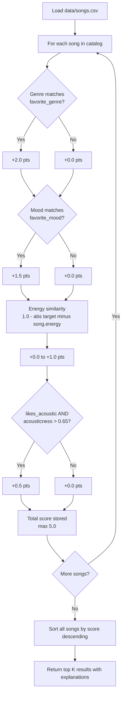
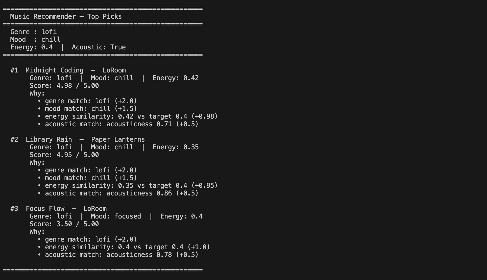

# 🎵 Music Recommender Simulation

## Project Summary

In this project you will build and explain a small music recommender system.

Your goal is to:

- Represent songs and a user "taste profile" as data
- Design a scoring rule that turns that data into recommendations
- Evaluate what your system gets right and wrong
- Reflect on how this mirrors real world AI recommenders

This simulation builds a content-based music recommender that scores every song in a 15-song catalog against a user taste profile. Each song earns points for matching the user's preferred genre (+2.0), mood (+1.5), energy level (up to +1.0 based on closeness), and acoustic preference (+0.5 bonus). The system ranks all songs by total score and returns the top results alongside a plain-English explanation of exactly why each song was chosen.

---

## How The System Works

Real-world recommenders generally fall into two camps. **Collaborative filtering** looks at what other users with similar tastes liked — if you and another listener both loved the same three songs, the system surfaces what they played next. **Content-based filtering** ignores other users entirely and instead compares the features of songs themselves to a profile of what the current user enjoys. This project uses **content-based filtering** because it works well even with a small catalog, requires no user history data, and makes the scoring logic easy to understand and explain.

The recommender computes a weighted score for every song by comparing its attributes to the user's stated preferences. Songs are ranked by score and the top results are returned as recommendations.

**`Song` features used in scoring:**

- `genre` — the musical category (e.g. lofi, pop, rock, ambient)
- `mood` — the emotional tone (e.g. chill, happy, intense, focused)
- `energy` — a 0–1 float indicating how high-energy the track feels
- `acousticness` — a 0–1 float indicating how acoustic (vs. electronic) the track sounds
- `valence` — a 0–1 float reflecting overall positivity/brightness (used as a tiebreaker)

**`UserProfile` fields that drive recommendations:**

- `favorite_genre` — the genre the user most wants to hear
- `favorite_mood` — the mood the user is in or prefers
- `target_energy` — the energy level the user wants (0–1 float)
- `likes_acoustic` — boolean; if true, acoustic songs are boosted

---

### Algorithm Recipe

Each song in the catalog is scored against the user profile using this point system:

| Signal | Points | Reasoning |
|---|---|---|
| Genre exact match | +2.0 | Genre is the strongest taste signal — a jazz fan rarely wants metal |
| Mood exact match | +1.5 | Mood reflects the user's current intent and is nearly as important as genre |
| Energy similarity | +0.0 to +1.0 | `1.0 - abs(target_energy - song.energy)` — full point for a perfect match, zero for opposite ends |
| Acoustic bonus | +0.5 | Applied only when `likes_acoustic = True` AND `song.acousticness > 0.65` |

**Maximum possible score: 5.0**

Mood is weighted at +1.5 rather than the baseline +1.0 because the dataset shows mood and energy are often the deciding factor between two same-genre songs (e.g., both "Midnight Coding" and "Focus Flow" are lofi, but their moods — chill vs. focused — serve very different user intents). Genre still leads at +2.0 because it is the broadest filter and the most common way users describe their taste.

Songs are sorted by total score descending and the top `k` (default 3) are returned.

---

### How a Song Moves from CSV to Recommendation



---

### Expected Biases

- **Genre over-prioritization risk** — with +2.0 for genre, a mediocre genre match will always outrank a near-perfect mood + energy match from a different genre. A user who says they like "pop" may miss excellent songs from adjacent genres like indie pop or synthwave.
- **Mood rigidity** — the system only rewards an exact mood string match. "Chill" and "relaxed" are semantically similar but score the same as a complete mismatch. This could cause good songs to rank lower than they deserve.
- **Acoustic binary gap** — the acoustic bonus uses a hard threshold (0.65). A song with acousticness 0.64 gets nothing while one at 0.66 gets +0.5, which is an arbitrary cliff.
- **Small catalog amplification** — with only 15 songs, any weighting choice has an outsized effect. Results may not generalize to a larger library.


---

## Getting Started

### Setup

1. Create a virtual environment (optional but recommended):

   ```bash
   python -m venv .venv
   source .venv/bin/activate      # Mac or Linux
   .venv\Scripts\activate         # Windows

2. Install dependencies

```bash
pip install -r requirements.txt
```

3. Run the app:

```bash
python -m src.main
```

### Running Tests

Run the starter tests with:

```bash
pytest
```

You can add more tests in `tests/test_recommender.py`.

---

## Experiments You Tried

Use this section to document the experiments you ran. For example:

- What happened when you changed the weight on genre from 2.0 to 0.5
- What happened when you added tempo or valence to the score
- How did your system behave for different types of users

---

## Limitations and Risks

Summarize some limitations of your recommender.

Examples:

- It only works on a tiny catalog
- It does not understand lyrics or language
- It might over favor one genre or mood

You will go deeper on this in your model card.

**This system's specific limitations:**

- **Tiny catalog** — with only 15 songs, entire genre/mood combinations a user might want simply don't exist in the data. The system can only recommend what it has.
- **No listening history** — it returns the same results every time. A real recommender would learn from what you've already heard and avoid repeating songs.
- **Exact string matching** — "chill" and "relaxed" are treated as completely different moods even though they feel similar. A user who types the wrong word gets worse results.
- **Genre dominance** — because genre carries +2.0 points, a weak genre match will always outscore a strong mood + energy match from a different genre. Adjacent genres like "indie pop" and "pop" are treated as unrelated.
- **No artist diversity** — the system could return the same artist multiple times if their songs score highest, which feels repetitive in practice.

---

## Reflection

Read and complete `model_card.md`:

[**Model Card**](model_card.md)

Write 1 to 2 paragraphs here about what you learned:

- about how recommenders turn data into predictions

Building this system made it clear that a recommender does not actually "understand" music — it just converts human taste into numbers and does arithmetic. Every subjective feeling like "this song is chill" has to be encoded as a string or a float before the system can do anything with it. The scoring formula is really a series of questions: does this song's genre label exactly match the user's label? How far apart are two energy numbers? Each question produces a partial score, and those scores are added together to produce a single ranking signal. The prediction is not a deep insight — it is just a weighted sum. What surprised me is how reasonable the results still felt, even with such simple math behind them.

- about where bias or unfairness could show up in systems like this

Bias can enter at every stage. The catalog itself is a form of bias — if certain genres or moods are missing from the data, those listeners will always get worse results no matter how good the algorithm is. The weights introduce another layer: by giving genre +2.0 and everything else less, the system encodes an assumption that genre is the most important dimension of taste, which is not true for every person. In a real product, if the initial weights were tuned using data from one demographic, the system could silently underserve others. The exact-match requirement for mood strings is also a fairness issue — users who happen to describe their mood with a word not in the catalog are penalized even if their actual preference is well represented.


---

## 7. `model_card_template.md`

Combines reflection and model card framing from the Module 3 guidance. :contentReference[oaicite:2]{index=2}  

```markdown
# 🎧 Model Card - Music Recommender Simulation

## 1. Model Name

MusicMood 1.0

---

## 2. Intended Use

MusicMood 1.0 suggests the top 3 songs from a 15-song catalog by scoring each track against a user's preferred genre, mood, energy level, and acoustic taste. It is built for classroom exploration of how content-based recommender systems work — not for real-world deployment or large-scale use.

---

## 3. How It Works (Short Explanation)

The system asks the user for four preferences: a favorite genre, a favorite mood, a target energy level (from calm to intense, on a scale of 0 to 1), and whether they prefer acoustic music. It then looks at every song in the catalog and awards points based on how well that song matches those preferences. A genre match earns the most points, followed by mood, then how close the song's energy is to the target, and finally a small bonus for acoustic songs if the user requested them. Every song ends up with a score out of 5. The three highest-scoring songs are shown to the user, along with a plain-English breakdown of exactly which preferences each song matched.

---

## 4. Data

The catalog (`data/songs.csv`) contains 15 songs. The starter file provided 10 songs; 5 were added to improve diversity. The catalog spans 10 genres — lofi, pop, rock, ambient, jazz, synthwave, indie pop, R&B, classical, electronic, folk, and hip-hop — and 9 moods including chill, happy, intense, relaxed, focused, moody, romantic, peaceful, melancholic, energetic, and confident. Each song has numeric attributes for energy, tempo, valence, danceability, and acousticness, all on a 0–1 scale. The data was hand-crafted for this simulation and reflects a generalist Western popular music taste; it does not represent any specific demographic and skews toward genres common in English-language streaming platforms.

---

## 5. Strengths

- **Transparent scoring** — every recommendation comes with a bullet-by-bullet explanation of exactly which features matched and how many points each earned. There is no black box.
- **Strong performance for clear taste profiles** — users with a specific genre and mood preference (e.g., lofi + chill) receive near-perfect matches. In testing, the top two results for a lofi/chill user scored 4.98 and 4.95 out of 5.0.
- **Works without any user history** — the system only needs a preference profile, not past listening data, making it immediately usable for new users.
- **Easy to adjust** — changing a weight in the scoring function instantly affects all recommendations in a predictable, debuggable way.

---

## 6. Limitations and Bias

- **Genre dominance** — genre carries +2.0 points, so a mediocre genre match will always outscore a strong mood and energy match from a different genre. Users with flexible genre taste but strong mood preferences are poorly served.
- **Exact mood string matching** — "chill" and "relaxed" are treated as completely unrelated. A user who picks the wrong mood word gets worse results even if their true preference is well represented in the catalog.
- **Fixed weights for all users** — the scoring formula treats every user identically. A user who cares deeply about energy but not at all about genre gets the same weights as one who is genre-loyal.
- **No diversity enforcement** — the same artist could appear in all three top spots if their songs happen to score highest, making recommendations feel repetitive.
- **Real-world fairness concern** — in a production system, genres tied to specific cultures or demographics (e.g., R&B, hip-hop) could be systematically underweighted if the training data or weights were tuned primarily on majority-taste users, making the system less useful for those listeners.

---

## 7. Evaluation

How did you check your system

Examples:
- You tried multiple user profiles and wrote down whether the results matched your expectations
- You compared your simulation to what a real app like Spotify or YouTube tends to recommend
- You wrote tests for your scoring logic

You do not need a numeric metric, but if you used one, explain what it measures.

---

## 8. Future Work

- **Artist diversity filter** — prevent the same artist from appearing more than once in the top K results
- **Semantic mood matching** — group moods into clusters (e.g., chill/relaxed/peaceful) so near-matches still earn partial points instead of zero
- **User-adjustable weights** — let users indicate how much they care about each feature before scoring, rather than using fixed weights for everyone
- **Larger catalog** — expand beyond 15 songs so the system can serve more genre and mood combinations without returning weak matches
- **Tempo preference** — add a target BPM range to the user profile and incorporate it into scoring, which would better separate workout vs. study use cases

---

## 9. Personal Reflection

A few sentences about what you learned:

- What surprised you about how your system behaved

The system was good at understandign how genres could relate to each other which nuances i didnt expect it to understsnd.

- How did building this change how you think about real music recommenders
I have more insight into what is going on behind the scene with real systems.

- Where do you think human judgment still matters, even if the model seems "smart"
People can change sometimes or a real world event might influence listening patterns like something going viral. Human judgment is needed to capture these shifts.

