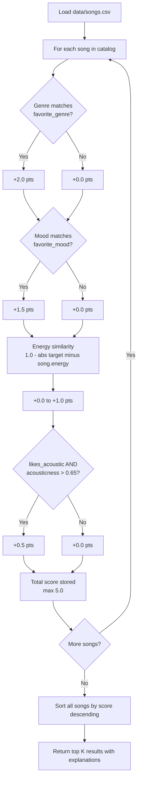

# 🎵 Music Recommender Simulation

## Project Summary

In this project you will build and explain a small music recommender system.

Your goal is to:

- Represent songs and a user "taste profile" as data
- Design a scoring rule that turns that data into recommendations
- Evaluate what your system gets right and wrong
- Reflect on how this mirrors real world AI recommenders

Replace this paragraph with your own summary of what your version does.

---

## How The System Works

Real-world recommenders generally fall into two camps. **Collaborative filtering** looks at what other users with similar tastes liked — if you and another listener both loved the same three songs, the system surfaces what they played next. **Content-based filtering** ignores other users entirely and instead compares the features of songs themselves to a profile of what the current user enjoys. This project uses **content-based filtering** because it works well even with a small catalog, requires no user history data, and makes the scoring logic easy to understand and explain.

The recommender computes a weighted score for every song by comparing its attributes to the user's stated preferences. Songs are ranked by score and the top results are returned as recommendations.

**`Song` features used in scoring:**

- `genre` — the musical category (e.g. lofi, pop, rock, ambient)
- `mood` — the emotional tone (e.g. chill, happy, intense, focused)
- `energy` — a 0–1 float indicating how high-energy the track feels
- `acousticness` — a 0–1 float indicating how acoustic (vs. electronic) the track sounds
- `valence` — a 0–1 float reflecting overall positivity/brightness (used as a tiebreaker)

**`UserProfile` fields that drive recommendations:**

- `favorite_genre` — the genre the user most wants to hear
- `favorite_mood` — the mood the user is in or prefers
- `target_energy` — the energy level the user wants (0–1 float)
- `likes_acoustic` — boolean; if true, acoustic songs are boosted

---

### Algorithm Recipe

Each song in the catalog is scored against the user profile using this point system:

| Signal | Points | Reasoning |
|---|---|---|
| Genre exact match | +2.0 | Genre is the strongest taste signal — a jazz fan rarely wants metal |
| Mood exact match | +1.5 | Mood reflects the user's current intent and is nearly as important as genre |
| Energy similarity | +0.0 to +1.0 | `1.0 - abs(target_energy - song.energy)` — full point for a perfect match, zero for opposite ends |
| Acoustic bonus | +0.5 | Applied only when `likes_acoustic = True` AND `song.acousticness > 0.65` |

**Maximum possible score: 5.0**

Mood is weighted at +1.5 rather than the baseline +1.0 because the dataset shows mood and energy are often the deciding factor between two same-genre songs (e.g., both "Midnight Coding" and "Focus Flow" are lofi, but their moods — chill vs. focused — serve very different user intents). Genre still leads at +2.0 because it is the broadest filter and the most common way users describe their taste.

Songs are sorted by total score descending and the top `k` (default 3) are returned.

---

### How a Song Moves from CSV to Recommendation



---

### Expected Biases

- **Genre over-prioritization risk** — with +2.0 for genre, a mediocre genre match will always outrank a near-perfect mood + energy match from a different genre. A user who says they like "pop" may miss excellent songs from adjacent genres like indie pop or synthwave.
- **Mood rigidity** — the system only rewards an exact mood string match. "Chill" and "relaxed" are semantically similar but score the same as a complete mismatch. This could cause good songs to rank lower than they deserve.
- **Acoustic binary gap** — the acoustic bonus uses a hard threshold (0.65). A song with acousticness 0.64 gets nothing while one at 0.66 gets +0.5, which is an arbitrary cliff.
- **Small catalog amplification** — with only 15 songs, any weighting choice has an outsized effect. Results may not generalize to a larger library.

---

## Getting Started

### Setup

1. Create a virtual environment (optional but recommended):

   ```bash
   python -m venv .venv
   source .venv/bin/activate      # Mac or Linux
   .venv\Scripts\activate         # Windows

2. Install dependencies

```bash
pip install -r requirements.txt
```

3. Run the app:

```bash
python -m src.main
```

### Running Tests

Run the starter tests with:

```bash
pytest
```

You can add more tests in `tests/test_recommender.py`.

---

## Experiments You Tried

Use this section to document the experiments you ran. For example:

- What happened when you changed the weight on genre from 2.0 to 0.5
- What happened when you added tempo or valence to the score
- How did your system behave for different types of users

---

## Limitations and Risks

Summarize some limitations of your recommender.

Examples:

- It only works on a tiny catalog
- It does not understand lyrics or language
- It might over favor one genre or mood

You will go deeper on this in your model card.

---

## Reflection

Read and complete `model_card.md`:

[**Model Card**](model_card.md)

Write 1 to 2 paragraphs here about what you learned:

- about how recommenders turn data into predictions
- about where bias or unfairness could show up in systems like this


---

## 7. `model_card_template.md`

Combines reflection and model card framing from the Module 3 guidance. :contentReference[oaicite:2]{index=2}  

```markdown
# 🎧 Model Card - Music Recommender Simulation

## 1. Model Name

Give your recommender a name, for example:

> VibeFinder 1.0

---

## 2. Intended Use

- What is this system trying to do
- Who is it for

Example:

> This model suggests 3 to 5 songs from a small catalog based on a user's preferred genre, mood, and energy level. It is for classroom exploration only, not for real users.

---

## 3. How It Works (Short Explanation)

Describe your scoring logic in plain language.

- What features of each song does it consider
- What information about the user does it use
- How does it turn those into a number

Try to avoid code in this section, treat it like an explanation to a non programmer.

---

## 4. Data

Describe your dataset.

- How many songs are in `data/songs.csv`
- Did you add or remove any songs
- What kinds of genres or moods are represented
- Whose taste does this data mostly reflect

---

## 5. Strengths

Where does your recommender work well

You can think about:
- Situations where the top results "felt right"
- Particular user profiles it served well
- Simplicity or transparency benefits

---

## 6. Limitations and Bias

Where does your recommender struggle

Some prompts:
- Does it ignore some genres or moods
- Does it treat all users as if they have the same taste shape
- Is it biased toward high energy or one genre by default
- How could this be unfair if used in a real product

---

## 7. Evaluation

How did you check your system

Examples:
- You tried multiple user profiles and wrote down whether the results matched your expectations
- You compared your simulation to what a real app like Spotify or YouTube tends to recommend
- You wrote tests for your scoring logic

You do not need a numeric metric, but if you used one, explain what it measures.

---

## 8. Future Work

If you had more time, how would you improve this recommender

Examples:

- Add support for multiple users and "group vibe" recommendations
- Balance diversity of songs instead of always picking the closest match
- Use more features, like tempo ranges or lyric themes

---

## 9. Personal Reflection

A few sentences about what you learned:

- What surprised you about how your system behaved
- How did building this change how you think about real music recommenders
- Where do you think human judgment still matters, even if the model seems "smart"

